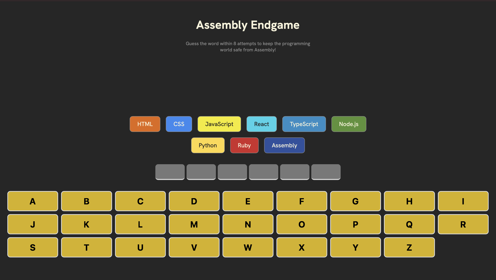
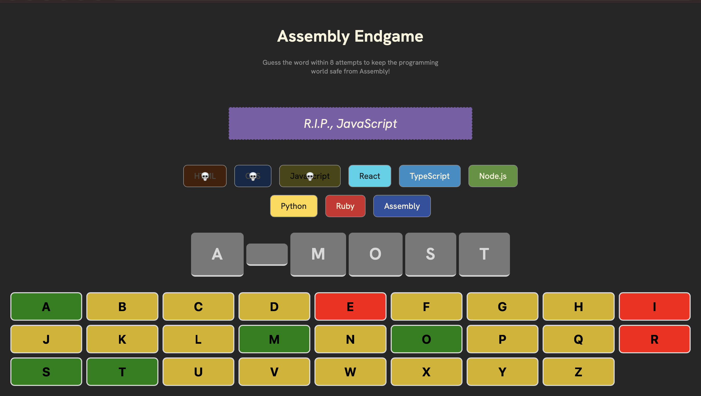
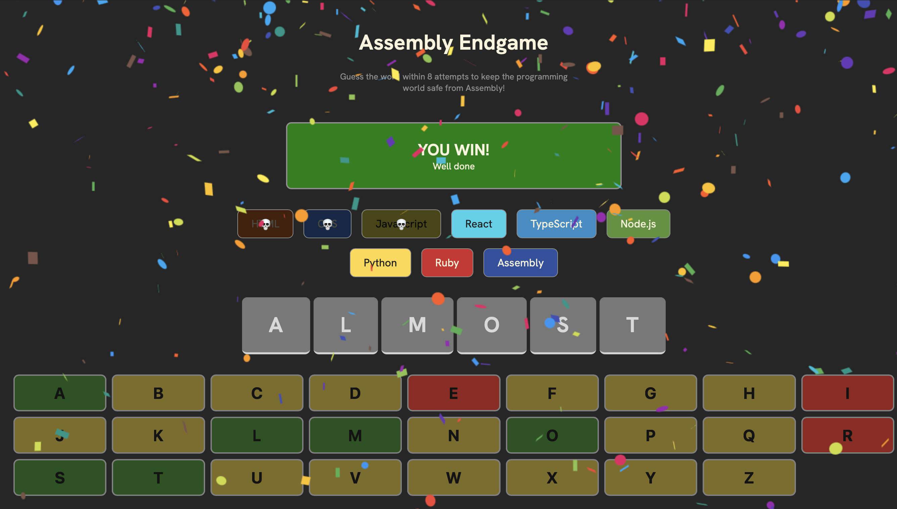
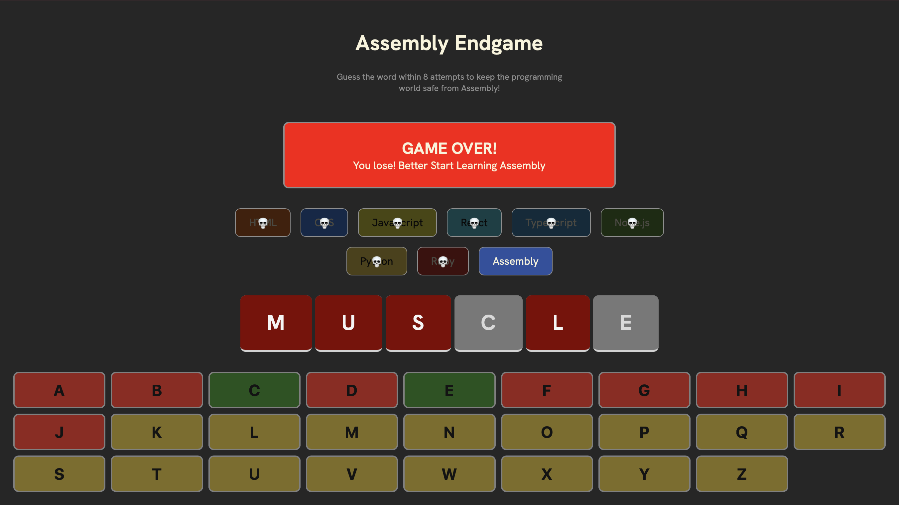

# Assembly Endgame

A word-guessing game built with React — guess the hidden word one letter at a time before you run out of attempts and lose all the programming languages to Assembly!

This project was built as part of the [Scrimba Full-Stack Developer path](https://scrimba.com/), React Fundamentals module.

## Preview

**Start screen**



**Guessing a word**



**Winning state**



**Losing state**



## How to Play

1. A random word is selected when the game starts.
2. Click letters on the on-screen keyboard to guess the word.
3. Each correct guess reveals the letter in the word.
4. Each wrong guess "loses" one programming language from the list — reach the end of the list and it's game over.
5. Guess every letter in the word before you run out of languages to win.
6. Click **New Game** to reset and play again.

## Features

- Random word selection on every game/reset
- Visual keyboard with correct/wrong letter states
- Programming language list that "dies off" with each wrong guess, with farewell messages
- Win animation using confetti
- Accessible, screen-reader-friendly live status updates (`aria-live` regions)

## Tech Stack

- [React 19](https://react.dev/)
- [Vite](https://vitejs.dev/) — build tool & dev server
- [clsx](https://github.com/lukeed/clsx) — conditional class names
- [react-confetti](https://github.com/alampros/react-confetti) — win celebration effect
- [ESLint](https://eslint.org/) — linting

## Getting Started

### Prerequisites

- [Node.js](https://nodejs.org/) installed

### Installation

```bash
npm install
```

### Run the dev server

```bash
npm run dev
```

### Build for production

```bash
npm run build
```

### Preview the production build

```bash
npm run preview
```

### Lint

```bash
npm run lint
```

## Project Structure

```
src/
├── App.jsx                     # App entry component
├── main.jsx                    # React root render
├── index.css                   # Global styles
├── images/                     # Screenshots used in this README
└── assets/
    ├── mainComponent.jsx       # Core game logic and layout
    ├── keyboard.jsx            # On-screen keyboard component
    ├── languagesElement.jsx    # Programming language chips list
    ├── languages.js            # Language data (name, color, backgroundColor)
    ├── words.js                # Word bank for the game
    └── utils.js                # Helpers: random word, farewell messages
```
